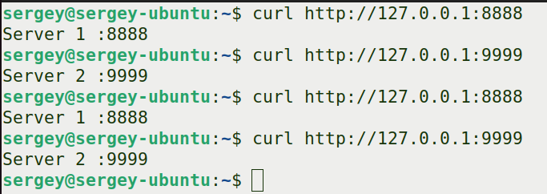
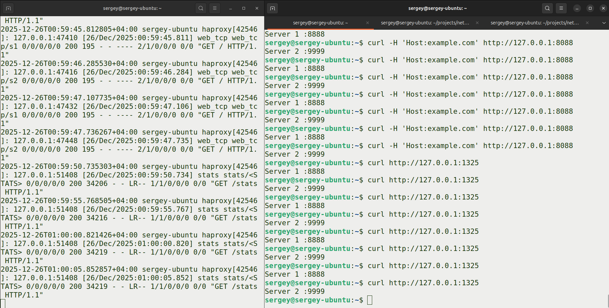
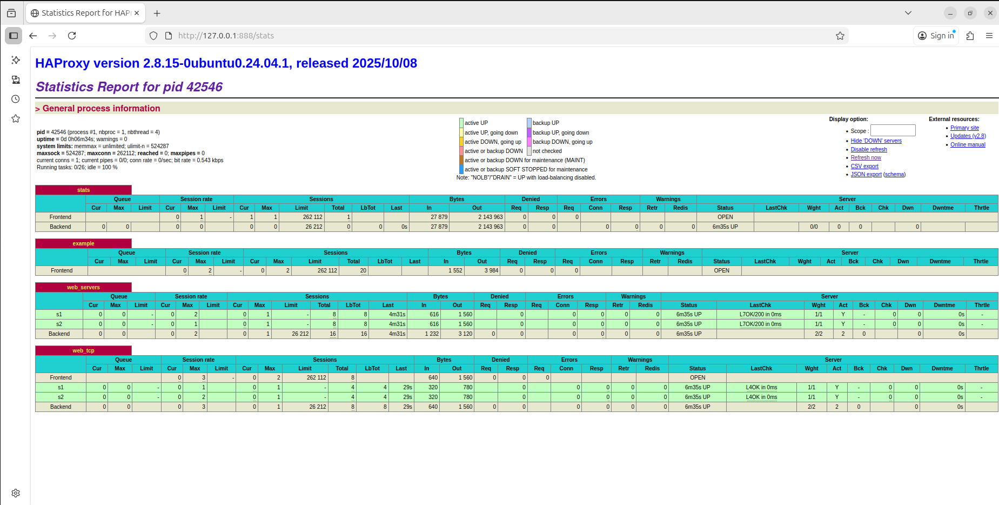
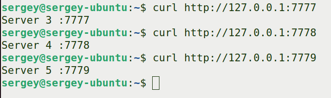
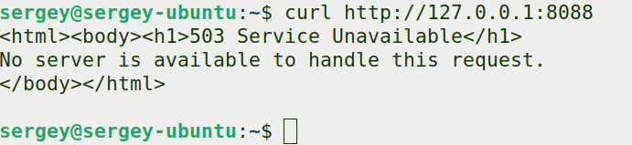

# Домашнее задание к занятию 2 «Кластеризация и балансировка нагрузки» - Мешков Сергей

---

## Задание 1

**Запустите два simple python сервера на своей виртуальной машине на разных портах. Установите и настройте HAProxy. Настройте балансировку Round-robin на 4 уровне.**

### Выполненные этапы:

1.  **Подготовка инфраструктуры:**
    Созданы две директории с уникальными файлами `index.html`:
    - `http1`: `Server 1 :8888`
    - `http2`: `Server 2 :9999`

2.  **Запуск Python-серверов:**
    ```bash
    # В директории http1
    python3 -m http.server 8888 --bind 127.0.0.1
    # В директории http2
    python3 -m http.server 9999 --bind 127.0.0.1
    ```

3.  **Проверка работы серверов:**

    

4.  **Установка HAProxy:**
    ```bash
    sudo apt update && sudo apt install -y haproxy
    sudo systemctl enable --now haproxy
    ```

5.  **Конфигурация для L4-балансировки (файл `/etc/haproxy/haproxy.cfg`):**
    ```haproxy
    listen web_tcp
        bind :1325
        server s1 127.0.0.1:8888 check inter 3s
        server s2 127.0.0.1:9999 check inter 3s
    ```

6.  **Применение конфигурации:**
    ```bash
    sudo haproxy -c -f /etc/haproxy/haproxy.cfg
    sudo systemctl restart haproxy
    ```

7.  **Демонстрация работы Round-robin на 4 уровне:**
    ```bash
    for i in {1..6}; do curl http://127.0.0.1:1325; echo "---"; sleep 1; done
    ```
### Файлы для задания 1:
- [haproxy.cfg](files/haproxy.cfg) - конфигурационный файл HAProxy с секцией `listen web_tcp`.
### Скриншоты:
 - демонстрирующий чередование ответов от двух серверов при обращении к порту `1325`.
 - Скриншот веб-интерфейса статистики HAProxy

---

## Задание 2

**Запустите три simple python сервера на своей виртуальной машине на разных портах. Настройте балансировку Weighted Round Robin на 7 уровне, чтобы первый сервер имел вес 2, второй - 3, а третий - 4. HAProxy должен балансировать только тот http-трафик, который адресован домену example.local.**

### Выполненные этапы:

1.  **Подготовка инфраструктуры:**
    Созданы три директории с уникальными файлами `index.html`:
    - `http3`: `Server 3 :7777`
    - `http4`: `Server 4 :7778`
    - `http5`: `Server 5 :7779`

2.  **Запуск трёх Python-серверов:**
    ```bash
    python3 -m http.server 7777 --bind 127.0.0.1
    python3 -m http.server 7778 --bind 127.0.0.1
    python3 -m http.server 7779 --bind 127.0.0.1
    ```

3.  **Проверка работы серверов:**


4.  **Конфигурация HAProxy для Weighted Round Robin (файл `/etc/haproxy/haproxy.cfg`):**
    ```haproxy
    frontend http_front
        mode http
        bind :8088
        acl host_example hdr(host) -i example.local
        use_backend weighted_servers if host_example

    backend weighted_servers
        mode http
        balance roundrobin
        option httpchk
        http-check send meth GET uri /index.html
        server s3 127.0.0.1:7777 weight 2 check
        server s4 127.0.0.1:7778 weight 3 check
        server s5 127.0.0.1:7779 weight 4 check
    ```

5.  **Применение конфигурации:**
    ```bash
    sudo haproxy -c -f /etc/haproxy/haproxy.cfg
    sudo systemctl restart haproxy
    ```

6.  **Демонстрация работы Weighted Round Robin:**
    ```bash
    for i in {1..12}; do curl -H "Host: example.local" http://127.0.0.1:8088; echo "---"; sleep 0.3; done
    ```
    **Пример вывода (пропорция ~2:3:4):**


7.  **Проверка избирательности балансировки:**
    ```bash
    # Запрос БЕЗ домена - не балансируется
    curl http://127.0.0.1:8088
    # Вывод: 503 Service Unavailable (No server is available...)
    ```
    

---
